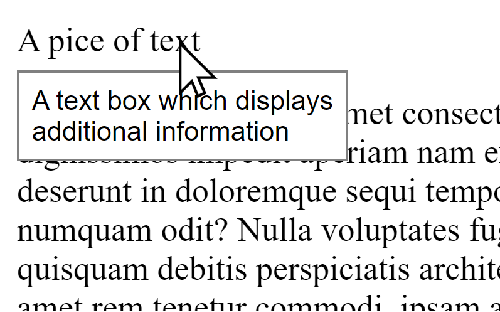

# Hoverer

## About

Hoverer is a library for creating a text box which displays additional information that appears upon hovering on top of an HTML element.



## installation

To install you can either use npm:

```console
npm i hoverer
```

Or just download the one file from github.

Either way to include the file in your project simply link it in your HTML:

```html
<body>
  <script src="node_modules/hoverer/hoverer.js" defer></script>
</body>
```

## usage

To apply the hoverer effect to an element you can use one of 2 methods:

1. Through js using the `applyHoverer` function:

   ```js
   applyHoverer(myElement, "some text");

   // Results in a text box saying 'some text' that shows up when the mouse hovers on `myElement`.
   ```

   With this function you can set a specific pice of text that will show up on hover.

1. Through html with a data attribute. When doing it this way, you can choose between 2 different data attributes:

   1. `data-hoverer-text`:

      ```html
      <p data-hoverer-text="some text">pice of text</p>

      <!-- Results in a text box saying 'some text' that shows up when the mouse hovers on the p element. -->
      ```

      With this attribute you can set a specific pice of text that will show up on hover.

   1. `data-hoverer-infer`:

      ```html
      

      <!-- Results in a text box which displays the content of the 'alt' property of the img element ('an image') and shows up when the mouse hovers on the img element. -->
      ```

      With this attribute you can make hoverer display a pice of text that is based on one of the element's properties that will show up on hover.

      You can also set the attribute to 'auto' and make hoverer decide which property to infer:

      ```html
      <a href="someImage.png" data-hoverer-infer="auto">a link</a>

      <!-- Results in a text box which displays the content of the 'href' property of the `a` element ('an image') and shows up when the mouse hovers over the img element. -->
      ```
